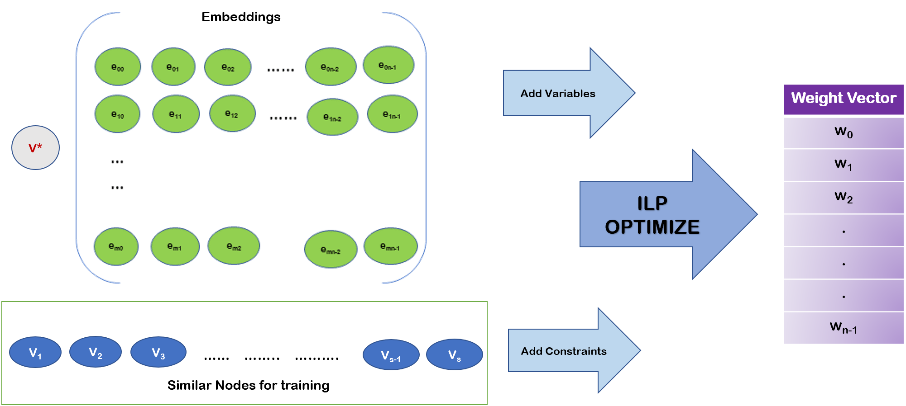
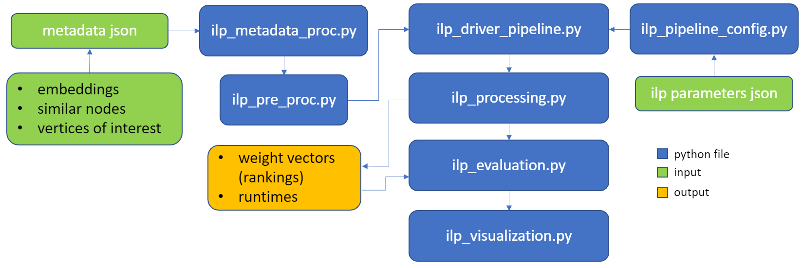
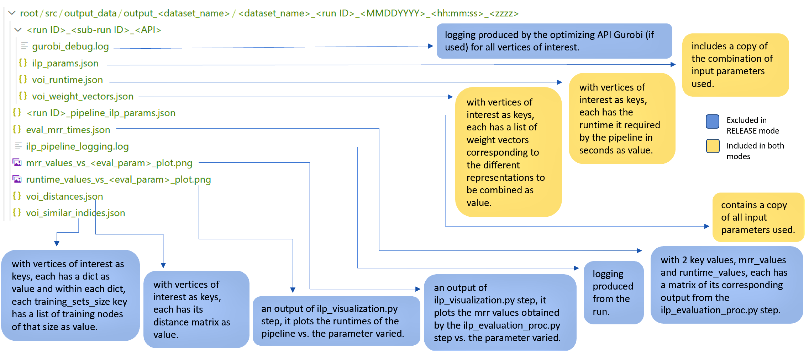

# Improve Ranking by Combining Embeddings using Integer Linear Programming (ILP)

## 1. Introduction

This is an SDK that provides the tools necessary to improve ranking by combining distance embeddings using integer linear programming (ILP). This results in a more accurate optimized ranking of nodes relative to a vertix of interest (voi).

Learning to rank – producing a ranked list of items specific to a query and with respect to a set of supervisory items – is a problem of general interest. The setting we consider is one in which no analytic description of what constitutes a good ranking is available. Instead, we have a collection of representations and supervisory information consisting of a (target item, interesting items set) pair. We demonstrate – analytically, in simulation, and in real data examples – that learning to rank via combining representations using an integer linear program (ILP) is effective when the supervision is as light as "these few items are similar to your item of interest." While this nomination task is of general interest, for specificity we present our methodology from the perspective of vertex nomination in graphs.

>The following diagram demonstrates how ILP is used to optimize ranking, returning a weight vector that's used to calculate the weighted averge of the embeddings:

### 1.1. Table of Contents
  - [1. Introduction](#1-introduction)
    - [1.1. Table of Contents](#11-table-of-contents)
  - [2. Setup](#2-setup)
    - [2.1. Getting Started](#21-getting-started)
      - [2.1.1. Repo Setup](#211-repo-setup)
    - [2.2. Install](#22-install)
    - [2.3. Gurobi API License](#23-gurobi-api-license)
    - [2.4. Code Dependencies](#24-code-dependencies)
  - [3. How to run and test the SDK](#3-how-to-run-and-test-the-sdk)
    - [3.1. APIs and Solvers](#31-apis-and-solvers)
    - [3.2. Usage Parameters](#32-usage-parameters)
    - [3.3. Demo](#33-demo)
      - [3.3.1 Example 1](#331-example-1)
      - [3.3.2 Example 2](#332-example-2)
  - [4. Pipeline Layout](#4-pipeline-layout)
    - [4.1. Data Input](#41-data-input)
      - [4.1.1. Metadata](#411-metadata)
      - [4.1.2. Test Data](#412-test-data)
    - [4.2. Input Parameters](#42-input-parameters)
    - [4.3. Output Results](#43-output-results)
      - [4.3.1. Output Modes](#431-output-modes)
      - [4.3.2. Output Layout](#432-output-layout)
  - [5. Contributing](#5-contributing)
  - [6. Contributors](#6-contributors)
  - [7. Legal Notices](#7-legal-notices)
    - [7.1. Trademark Notice](#71-trademark-notice)
    - [7.2 Security Reporting](#72-security-reporting)

## 2. Setup

### 2.1. Getting Started

#### 2.1.1. Repo Setup

Getting started...
>You will need to clone this repo to your local machine:

    $ git clone TBD ilp-sdk

### 2.2. Install

Next, in order to install all needed dependencies before running or testing this SDK.
>Run the bash file [install.sh](./scripts/install.sh).

    $ PATH/install.sh

>If you receive the following error:

    bash: ./install.sh: Permission denied

>You will need to change mode first to make the script writable and executable, type the following line in command line before running [install.sh](./scripts/install.sh) again, as explained above:

    $ chmod +x ./install.sh

>If your installations failed and you're using a Windows system, this might have caused the line endings in [install.sh](./scripts/install.sh) to be in Windows format ('\n\r'). To convert the line endings to be in the correct Unix format, type the following in command line before running [install.sh](./scripts/install.sh) again, as explained above:

    `$ sudo sed -i.bak '/\r$//' install.sh`

*Provide password for root access if needed and wait for the installations to complete.*

### 2.3. Gurobi API License

If you plan on using the Gurobi API, please note that the pip installation used in [install.sh](./scripts/install.sh) includes a limited license that allows you to solve small optimization problems. If you require an academic or evaluation license, you can refer to the [Gurobi's downlaod center](https://www.gurobi.com/downloads/) to obtain a free, unlimited academic license or contact them to obtain an evaluation license.

### 2.4. Code Dependencies
<table>
  <tr>
    <td>
      <table border="0">
        <tr><td><b> Package</b></td><td><b> Version</td></tr>
        <tr><td>pickle-mixin</td><td>1.0.2</td></tr>
        <tr><td>pathlib</td><td>1.0.1</td></tr>
        <tr><td>typing</td><td>3.7.4.3</td></tr>
        <tr><td>numpy</td><td>1.19.5</td></tr>
        <tr><td>pandas</td><td>1.1.5</td></tr>
        <tr><td>tqdm</td><td>4.50.2</td></tr>
        <tr><td>sklearn</td><td>0.0</td></tr>
        <tr><td>seaborn</td><td>0.11.1</td></tr>
        <tr><td>scipy</td><td>1.5.4</td></tr>
      </table>
    </td>
    <td>
      <table border="0">
        <tr><td><b> Package</b></td><td><b> Version</td></tr>
        <tr><td>click</td><td>7.1.2</td></tr>
        <tr><td>pytz</td><td>2021.1</td></tr>
        <tr><td>Datetime</td><td>4.3</td></tr>
        <tr><td>matplotlib</td><td>3.3.4</td></tr>
        <tr><td>colorama</td><td>0.3.7</td></tr>
        <tr><td>joblib</td><td>1.0.1</td></tr>
        <tr><td>PuLP</td><td>2.3</td></tr>
        <tr><td>mip</td><td>1.12.0</td></tr>
        <tr><td>gurobipy</td><td>9.0.3</td></tr>
      </table>
    </td>
  </tr>
</table>

## 3. How to run and test the SDK

### 3.1. APIs and Solvers

There are multiple optimizing APIs and solvers to choose from that are already implemented into the pipeline:  

•	**[Gurobi](https://www.gurobi.com/downloads/gurobi-software/
)**: our recommended choice, as per our experimentation, Gurobi’s commercial optimization solver has proved to be the fastest we have experimented with, see 2.3. on how to obtain a license.

•	**[PuLP](https://coin-or.github.io/pulp/index.html)**: an optimization API that can call on many solvers: its own native solver, PuLP, GLPK, COIN-OR CLP/CBC, CPLEX, GUROBI, MOSEK, XPRESS, CHOCO, MIPCL, SCIP to solve linear problems.

•	**[Py-MIP](https://docs.python-mip.com/en/latest/intro.html)**: another optimization API that can call on multiple solvers including, COIN-OR Linear Programming Solver - CLP, COIN-OR Branch-and-Cut solver - CBC, and Gurobi MIP solver.

*Note: If you choose to add other APIs, you can do so by modifying [ilp_processing.py](src/python/ilp_processing.py).*

### 3.2. Usage Parameters

The ILP SDK can be easily tested in terminal by running the [ilp_pipeline_driver.py](src/python/ilp_pipeline_driver.py) file in the command line with a variety of optional command line options.

> Running the SDK using no command line options will simply stick to the default values and use a random run ID:
  
    $ python3 ilp_pipeline_driver.py

For a detailed overview of all command line options, please refer to [usage_params.md](src/docs/usage_params.md).

### 3.3. Demo

The following example runs shows how one can test and use the SDK:

#### 3.3.1 Example 1
> Running a simple run using run ID: "example_1" and an input json file foo.json, for more details on the json structure, see template: [pipeline_driver_input_template.json](./json/pipeline_driver_input_template.json).

    $ python3 ilp_pipeline_driver.py --runid example_1 -i <path>/foo.json

#### 3.3.2 Example 2
>Runnning another example where the run ID, dataset name, root path, metadata path, output path, number of vertices of interest, training set sizes and indices are modified, all other parameters keep their default values. 

>We also create JSON file example_2_params.json to maintain a copy of all the parameters for future reruns under [driver_input_temp/](src/driver_input_temp/).

    $ python3 ilp_pipeline_driver.py --runid example_2 --dataset Dataset_example2 --root-path ../ --metadata-path ../data/Dataset_example2/metadata.json --output-path ../output_data/output_Dataset_example2/ --num-vois 4 –-training-sets-sizes [10,20,30] --indices [1111,2222,3333] -c example_2_params.json 

## 4. Pipeline Layout

>The SDK is based on the pipeline described by the diagram below:

### 4.1. Data Input

#### 4.1.1. Metadata

In order to process input data, the SDK requires metadata describing the latter. This metadata is organized in JSON config, for more details on how to construct the latter, refer to [metadata.md](src/docs/metadata.md).

#### 4.1.2. Test Data

For the purposes of testing the SDK, we've included an example [test set](src/data/test_set_data/). This set is used as part of the default values for the input parameters. It includes the following files:

- [embeddings/distance_matrices.pkl](src/data/test_set_data/embeddings/distance_matrices.pkl): a pkl file containing an array of arrays, each representing the distance matrix of the corresponding vertix of interest (voi). The array loaded from the file has a shape of: (50-vois, 40813-nodes, 2-emebddings). The distance matrices are in the same order as the vois in [metdata/voi_data.csv](src/data/test_set_data/metadata/voi_data.csv). 
- [metdata/voi_data.csv](src/data/test_set_data/metadata/voi_data.csv): a csv file conatining a list of all vois under the header "voi_id". In this case, the data uses the "ONE SET'" input_format_type, where each voi's testing_data is the same one set (all vois), excluding itself.
- [metadata.json](src/data/test_set_data/metadata.json): a json file conatining all metadata necessary to process the above input data. This file can serve as a good example of how to the write the metadata JSON file as described in [metadata.md](src/docs/metadata.md).

### 4.2. Input Parameters

Input parameters are necessary to run the ILP pipeline, the user can choose to modify as many of these parameters as they wish, unchanged parameters keep their default values. These parameters are organized in a json file, that could also serve as an input using parameter options, see template: [pipeline_driver_input_template.json](./json/pipeline_driver_input_template.json).

For a detailed description of each parameter, refer to [input_params.md](./docs/input_params.md)

### 4.3. Output Results

#### 4.3.1. Output Modes

The SDK has 2 run modes, this setting can be easily changed in the input parameters, see 3.2. for more details.

  * **DEBUG mode**: recommended for better output observation when debugging or modifying the pipeline. Can also be useful for reruns as it provides outputs for individual steps.

  * **RELEASE mode**: provides a subset of the output of DEBUG mode, as it focuses on the main output of the pipeline, the weight vectors used for combining the embedding representations.
  
#### 4.3.2. Output Layout

>All output results produced by a run are saved in the following format:

## 5. Contributing

For more information on contributing, see [CONTRIBUTING.md](./CONTRIBUTING.md).

This project has adopted the [Microsoft Open Source Code of Conduct](https://opensource.microsoft.com/codeofconduct/). For more information see the [Code of Conduct FAQ](https://opensource.microsoft.com/codeofconduct/faq/) or contact [opencode@microsoft.com](mailto:opencode@microsoft.com) with any additional questions or comments.

## 6. Contributors

For a list of all the great people who contributed to this project, see [CONTRIBUTORS.md](CONTRIBUTORS.md).

## 7. Legal Notices

#### 7.1. Trademark Notice

This project may contain trademarks or logos for projects, products, or services. Authorized use of Microsoft 
trademarks or logos is subject to and must follow [Microsoft's Trademark & Brand Guidelines](https://www.microsoft.com/en-us/legal/intellectualproperty/trademarks/usage/general).
Use of Microsoft trademarks or logos in modified versions of this project must not cause confusion or imply Microsoft sponsorship.
Any use of third-party trademarks or logos are subject to those third-party's policies.

#### 7.2. Security Reporting

For Security Reporting Instructions, see [SECURITY.md](./SECURITY.md).
